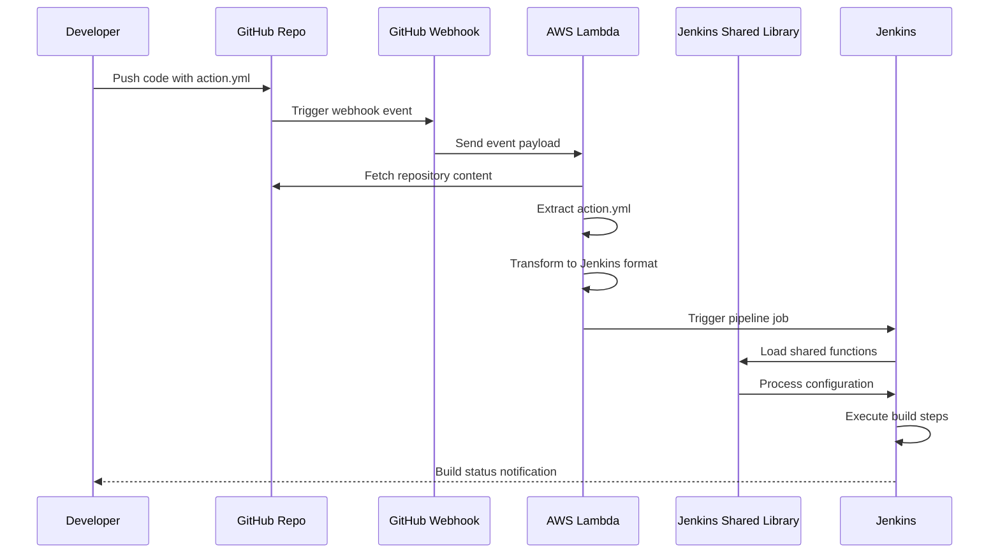

# public-repo

## Links

Github Event Design： https://github.com/copilot/share/081a123a-4084-8871-a140-3e0aa0e50966

```mermaid
sequenceDiagram
    participant Dev as Developer
    participant GH as GitHub Repo
    participant WH as GitHub Webhook
    participant Lambda as AWS Lambda
    participant JSL as Jenkins Shared Library
    participant JK as Jenkins

    Dev->>GH: Push code with action.yml
    GH->>WH: Trigger webhook event
    WH->>Lambda: Send event payload
    Lambda->>GH: Fetch repository content
    Lambda->>Lambda: Extract action.yml
    Lambda->>Lambda: Transform to Jenkins format
    Lambda->>JK: Trigger pipeline job
    JK->>JSL: Load shared functions
    JSL->>JK: Process configuration
    JK->>JK: Execute build steps
    JK-->>Dev: Build status notification
```
